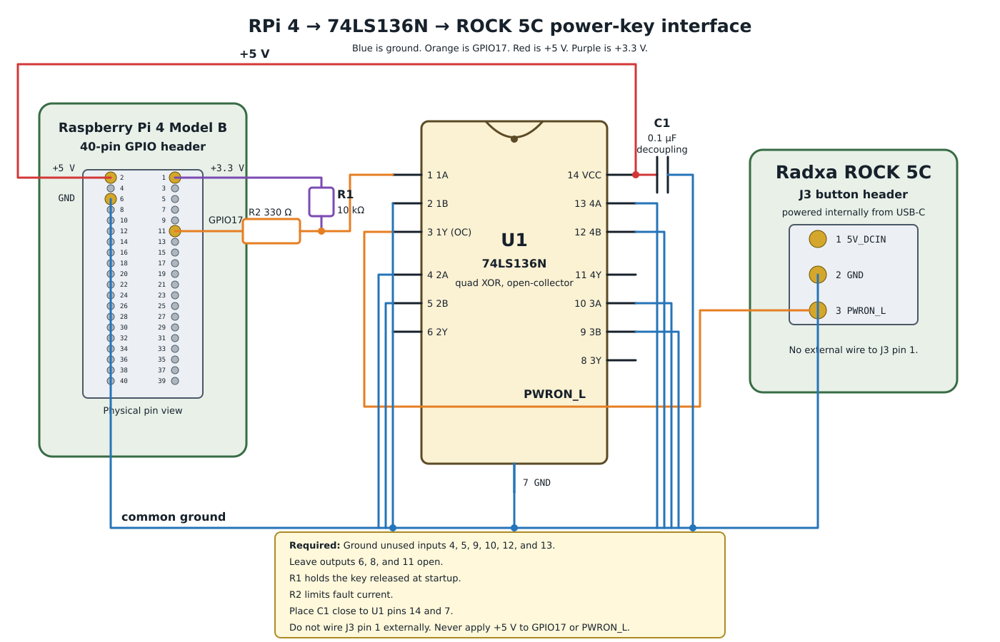

# Hardware CI demo

This circuit lets a Raspberry Pi 4 Model B assert the Radxa ROCK 5C
`PWRON_L` signal. It is for the talk, *Developing hardware at the speed of
software*.

[Open the SVG source.](schematic.svg)

## Connections

| 74LS136N pin | Connect to |
| --- | --- |
| 1 (`1A`) | RPi physical pin 11 (`GPIO17`) through 330 Ω (`R2`) |
| 2 (`1B`) | Common ground |
| 3 (`1Y`, open collector) | ROCK 5C J3 pin 3 (`PWRON_L`) |
| 7 (`GND`) | Common ground, RPi physical pin 6, and ROCK 5C J3 pin 2 |
| 14 (`VCC`) | RPi physical pin 2 (`+5 V`) |

Place a 0.1 µF ceramic decoupling capacitor between pins 14 and 7 near U1.
Connect GPIO17 to pin 1 through a 330 Ω series resistor. Connect a 10 kΩ
resistor from the pin 1 side of that resistor to RPi physical pin 1
(`+3.3 V`). The 10 kΩ resistor keeps the power key released while the RPi
starts. The 330 Ω resistor limits current during wiring or configuration
faults. Tie unused inputs 4, 5, 9, 10, 12, and 13 to ground. Leave unused
outputs 6, 8, and 11 unconnected.

If the breadboard has long power leads, add a 1 µF to 10 µF bulk capacitor
across the 74LS136N 5 V and ground rails. Keep the 0.1 µF capacitor even when
you add the bulk capacitor. The ROCK already provides the `PWRON_L` pull-up,
so do not add a pull-up on pin 3.

## Operation

The 74LS136N has open-collector outputs. With `1B` grounded, GPIO17 low
makes `1Y` pull `PWRON_L` low. GPIO17 high releases `1Y`, and the ROCK 5C
pull-up returns `PWRON_L` high. The Raspberry Pi never drives `PWRON_L`
high.

Request GPIO17 as an output with an initial high value in one atomic GPIO
operation. Pulse it low to emulate a power-button press. The ROCK 5C supplies
the pull-up for `PWRON_L`.

## Safety

Power off both boards before wiring them. Connect the common ground before
applying power. The ROCK USB-C input supplies J3 pin 1 through the on-board
`5V_DCIN` rail. Do not connect J3 pin 1 to the RPi or this interface. Do not
connect the RPi 5 V rail to J3 pin 3. Keep the RPi powered whenever the
74LS136N or ROCK is powered. Verify the board revision and J3 pin labels
before use.

## Project foundation

I reviewed `nix-project-template` and its customization guide. This initial
repository contains only a diagram and has no Nix output yet. The template
would add unused flake, formatting, hook, and CI configuration. It will
inform the later NixOS closure work when the project gains executable Nix
behavior.
